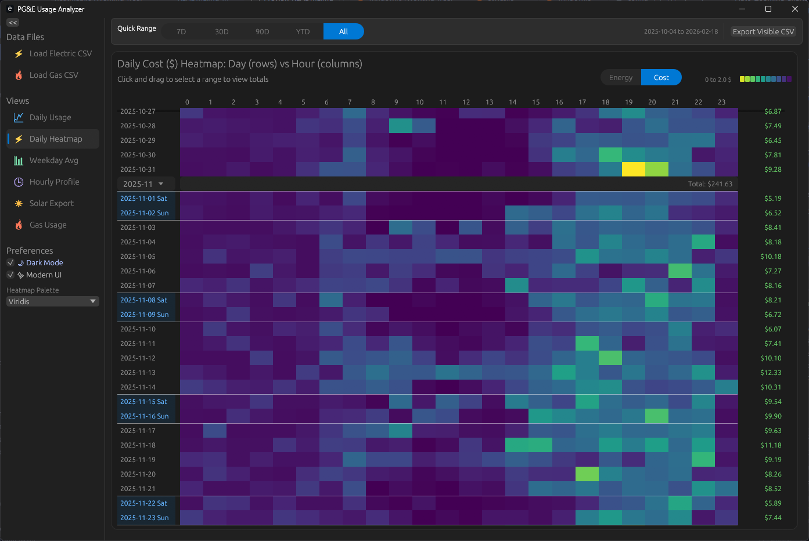

# PG&E Usage Analyzer - Rust GUI Application

A modern, cross-platform GUI application for visualizing PG&E electric and gas usage data, built with Rust.

<div align="center">
  
</div>

## Features

- **6 Interactive Charts**:
  1. Daily kWh - Line chart with 7-day rolling average
  2. Average kWh by Weekday and Hour - Heatmap visualization
  3. Daily by-hour kWh Heatmap - Detailed hourly usage patterns
  4. Daily by-hour Cost Heatmap - Cost analysis by hour
  5. Average Daily Profile - Typical hourly usage pattern
  6. Gas Daily Usage - Gas cost trends

- **Modern Windows 11-inspired UI**
- **Auto-detection of CSV files**
- **File dialog for manual CSV selection**
- **Interactive tooltips on heatmaps**
- **Smooth navigation between charts**

## Building the Application

### Prerequisites

- Rust toolchain
- Windows 10/11, macOS, or Linux

### Build Instructions

```bash
cd pge-analyzer
cargo build --release
```

The executable will be at:
- Windows: `target\release\pge-analyzer.exe`
- macOS/Linux: `target/release/pge-analyzer`

### Troubleshooting Build Issues

If you encounter "The process cannot access the file" errors (Error 32), this is typically caused by antivirus software scanning the build artifacts. Try these solutions:

1. **Add Build Exclusion to Windows Defender**:
   - Open Windows Security
   - Go to "Virus & threat protection" → "Manage settings"
   - Scroll to "Exclusions" → "Add or remove exclusions"
   - Add folder: `C:\proj\PGE\pge-analyzer\target`

2. **Temporarily Disable Real-time Protection**:
   - Open Windows Security
   - Go to "Virus & threat protection" → "Manage settings"
   - Turn off "Real-time protection" temporarily
   - Run the build
   - Re-enable protection after build completes

3. **Use Cargo Watch** (alternative):
   ```powershell
   cargo install cargo-watch
   cargo watch -x build
   ```

4. **Clean and Retry**:
   ```powershell
   cargo clean
   Start-Sleep -Seconds 5
   cargo build
   ```

## Running the Application

### From the Build Directory

```bash
cd pge-analyzer
cargo run
```

### Or Run the Executable Directly

**Windows:**
```powershell
.\target\release\pge-analyzer.exe
```

**macOS/Linux:**
```bash
./target/release/pge-analyzer
```

## Agent guide and sample data

For assistants and local testing, see `docs/AGENT_GUIDE.md` and the small synthetic samples in `data/samples/`.


## Usage

1. **Auto-Load Data**: The application automatically looks for CSV files matching:
   - `pge_electric*` for electric usage data
   - `pge_natural_gas*` for gas usage data

2. **Manual Load**: Use the "📂 Load Electric CSV" and "📂 Load Gas CSV" buttons in the sidebar to select files manually

3. **Navigate Charts**: Click on any chart name in the sidebar to switch views

4. **Interactive Features**:
   - Hover over heatmap cells to see detailed values
   - Scroll through large heatmaps
   - Resize the window as needed


## Dependencies

- **eframe** & **egui**: Modern immediate-mode GUI framework
- **egui_plot**: Plotting capabilities for line charts
- **csv** & **serde**: CSV parsing and deserialization
- **chrono**: Date and time handling
- **anyhow**: Error handling
- **rfd**: Native file dialogs
- **toml**: Configuration file support
- **dirs**: Cross-platform config directory detection

## Configuration

The application supports configuration via `config.toml` file:

### Configuration File Location

- **Windows**: `%APPDATA%\pge-analyzer\config.toml`
- **Linux/macOS**: `~/.config/pge-analyzer/config.toml`

### Creating Configuration

Copy `config.example.toml` to the appropriate location and modify as needed:

```bash
# Windows
copy config.example.toml "%APPDATA%\pge-analyzer\config.toml"

# Linux/macOS
mkdir -p ~/.config/pge-analyzer
cp config.example.toml ~/.config/pge-analyzer/config.toml
```

### Configuration Options

```toml
# Default directory to look for CSV files
default_data_dir = "C:/Users/YourName/Documents/PGE"

[window]
width = 1400.0
height = 900.0
maximized = false

[ui]
default_chart = "DailyKwh"  # Options: DailyKwh, WeekdayHeatmap, DailyHeatmap, HourlyProfile, GasDaily
dark_mode = true           # Force dark mode (optional)
font_scale = 1.0           # Font size multiplier
```

If no configuration file exists, the application will create one with default settings.
